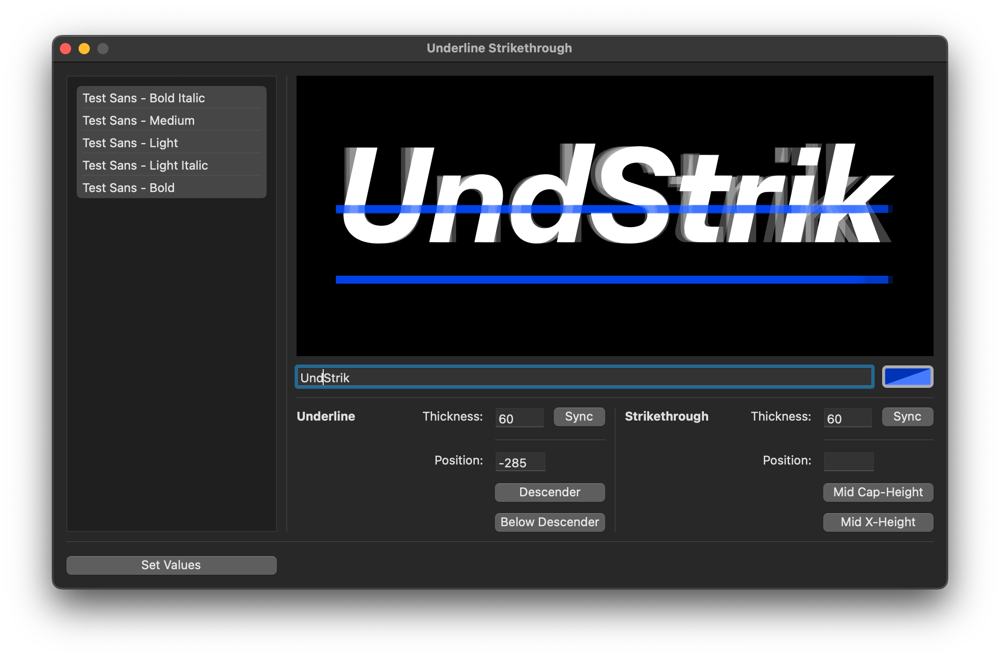

Underline Strikethrough
=======================

A RoboFont extension for setting underline and strikethrough values in all open UFO(s).

## How to Use:
Select the fonts the values of which you'd like to change in the left panel. Change the values in the bottom right area. To commit to all the values you've put together during the duration of your time in the extension, press "Set Values". *More info below:*

## User Interface:

### List of UFOs
This lists all currently-open UFOs. This now auto-updates when fonts are opened or closed.

### Preview Area
- **Preview:** This will show all fonts selected in the panel to the left, along with their corresponding underlines and strikethroughs.
- **Preview Text:** This is the text that you would like displayed in the view above. Default is `Hlpxtys`. *The extension will remember your settings for next time.*
- **Preview Color:** This is the color you would like the underline and strikethrough preview to have. *The extension will remember your settings for next time.*

### Underline Settings
- **Thickness:** The thickness of the underline. This corresponds to `font.info.postscriptUnderlineThickness`. Click "Sync" to set it to match the strikethrough thickness.
- **Position:** The position of the underline (the top of the line). 
- **Snap to Descender:** This will snap the descender value  of selected fonts to bottom-align with `font.info.descender`. *Note: this will not write the values into the font yet. This is just a quick operation for your convenience.*
- **Snap to Below Descender:** This will snap the descender value of selected fonts to an underline-thickness-distance below `font.info.descender`. *Note: this will not write the values into the font yet. This is just a quick operation for your convenience.*

The underline position will be written into your UFOs using the `font.lib` key `public.openTypePostUnderlinePosition` (this is the value you set in **Position**) and to the `font.info.postscriptUnderlinePosition`. The extension calculates the value for `font.info.postscriptUnderlinePosition` (lowering the underline position by half of the underline thickness).

Read [here](https://learn.microsoft.com/en-us/typography/opentype/spec/post) for more guidance on setting these values.

### Strikethrough Settings
- **Thickness:** The thickness of the strikethrough line. This corresponds to `font.info.openTypeOS2StrikeoutSize`. Click "Sync" to set it to match the underline thickness.
- **Position:** The position of the strikethrough line (the top of the line). This corresponds to `font.info.openTypeOS2StrikeoutPosition`. 
- **Snap to Mid-Cap-Height:** This will snap the strikethrough value of selected fonts to the mid-point between the baseline and `font.info.capHeight`. *Note: this will not write the values into the font yet. This is just a quick operation for your convenience.*
- **Snap to Mid-X-Height:** This will snap the strikethrough value of selected fonts to the mid-point between the baseline and `font.info.xHeight`. *Note: this will not write the values into the font yet. This is just a quick operation for your convenience.*

Read [here](https://learn.microsoft.com/en-us/typography/opentype/spec/os2) for more guidance on setting these values.

### Set Values
This will take all values entered in the extension and actually write them into all corresponding open UFOs.
*Note: this will not write the values into the font yet. This is just a quick operation for your convenience.*

#### Authors
Started by Ben Kiel in 2014. Ryan Bugden ([@ryanbugden](https://github.com/ryanbugden)) did a bunch of work updating and improving it in 2023.

